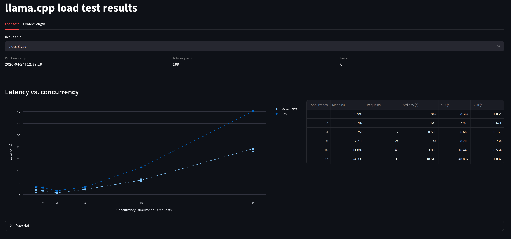
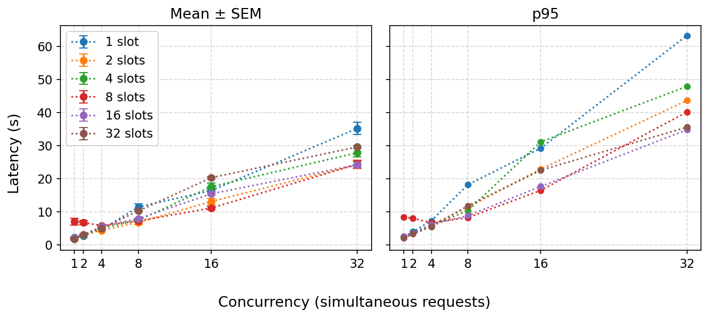
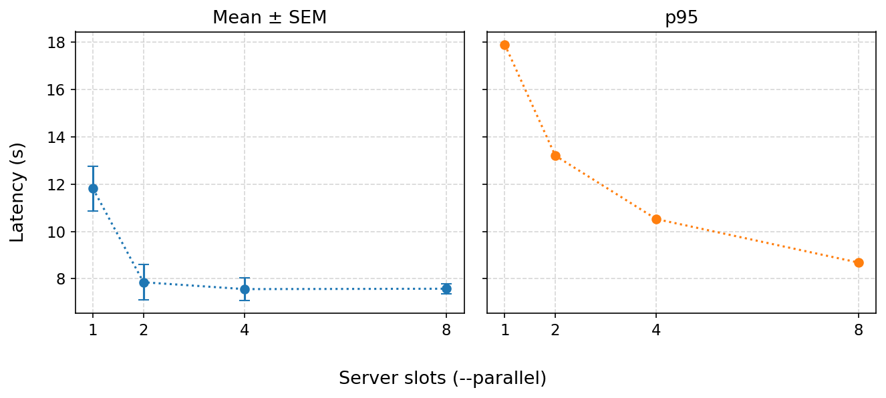
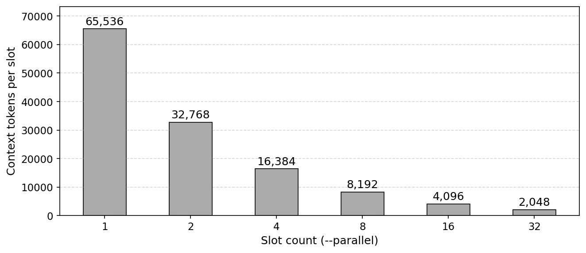
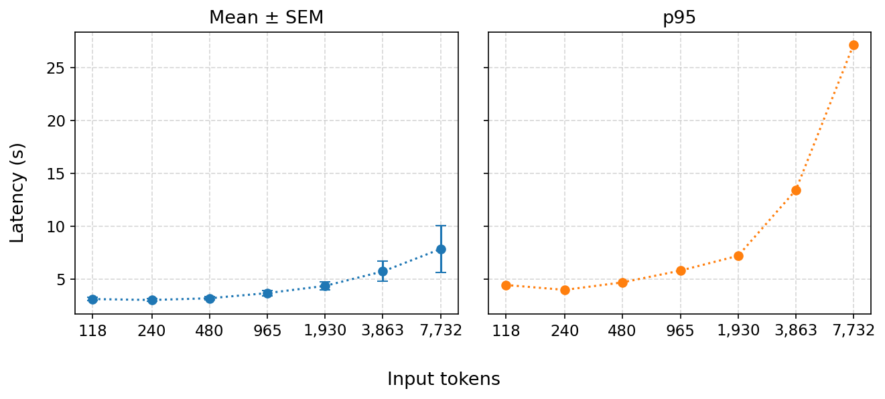

# llama.cpp inference server

[](https://github.com/ggml-org/llama.cpp)
[](https://developer.nvidia.com/cuda-toolkit)
[](https://www.python.org/)
[](https://platform.openai.com/docs/api-reference)
[](LICENSE)

This repository documents and centralizes the configuration of a `llama.cpp` inference server running as a systemd service on a dedicated model server. The server exposes an OpenAI-compatible API and supports multiple concurrent projects.

> **API gateway**: [gperdrizet/model-gateway](https://github.com/gperdrizet/model-gateway) — authentication, token metering, billing, and admin panel for this server


## Table of contents

- [API usage](#api-usage)
- [System overview](#system-overview)
- [Hardware](#hardware)
- [Installation layout](#installation-layout)
- [Systemd service](#systemd-service)
  - [Unit file](#unit-file)
  - [Override file](#override-file)
  - [Server flags explained](#server-flags-explained)
  - [Security hardening](#security-hardening)
  - [Restart policy](#restart-policy)
- [Parallelism](#parallelism)
- [Available models](#available-models)
- [Service management](#service-management)
- [Logs](#logs)
- [Load test](#load-test)
- [Context length test](#context-length-test)
- [Dashboard](#dashboard)
- [Performance](#performance)


## API usage

The server exposes an OpenAI-compatible API. Set the `Authorization` header with the API key from the unit file.

```bash
# Chat completion
curl http://localhost:8502/v1/chat/completions \
  -H "Content-Type: application/json" \
  -H "Authorization: Bearer <api-key>" \
  -d '{
    "model": "gpt-oss-20b-mxfp4",
    "messages": [{"role": "user", "content": "Hello!"}]
  }'

# Health check
curl http://localhost:8502/health
```

When configuring clients (LangChain, LlamaIndex, OpenWebUI, etc.), set:
- **Base URL**: `http://<model-server-ip>:8502/v1`
- **API Key**: value from the unit file


## System overview

| Property       | Value                          |
|----------------|-------------------------------|
| Kernel         | 6.8.x-generic                 |
| NVIDIA Driver  | 580.x                         |
| Service unit   | `llamacpp.service`            |
| Service user   | `llama`                       |
| Listening port | `8502`                        |
| API base URL   | `http://0.0.0.0:8502`        |

The server exposes an **OpenAI-compatible REST API** (`/v1/chat/completions`, `/v1/completions`, `/v1/embeddings`, etc.) as well as a Prometheus **metrics endpoint** at `/metrics`.


## Hardware

Two NVIDIA GPUs are present on the system:

| Device | Model                  | VRAM   | Role                            |
|--------|------------------------|--------|---------------------------------|
| `0`    | Tesla P100-PCIE-16GB   | 16 GiB | Active inference GPU (selected via `CUDA_VISIBLE_DEVICES=0`) |
| `1`    | GeForce GTX 1070       | 8 GiB  | Available; not currently used by the service |

The service pins to GPU 0 (the P100) via the `CUDA_VISIBLE_DEVICES=0` environment variable set in the systemd override. The P100's 16 GiB VRAM comfortably fits the active model (12 GiB) fully on-device.


## Installation layout

```
/opt/llama.cpp/                      # llama.cpp source + build tree (read-only to service)
└── build/
    └── bin/
        └── llama-server             # the inference server binary

/opt/models/                         # model storage (read-write to service)
├── gpt-oss-20b-mxfp4.gguf           # (12 GiB) ← currently active
├── mxbai-embed-large-v1-f16.gguf    # (639 MiB)
├── Qwen2.5-32B-Instruct-Q3_K_M.gguf # (15 GiB)
└── Qwen2.5-32B-Instruct-Q4_K_M.gguf # (19 GiB)

/etc/systemd/system/
├── llamacpp.service                 # main unit file
└── llamacpp.service.d/
    └── override.conf                # drop-in: sets CUDA_VISIBLE_DEVICES
```

The binary was built from source with CMake in **Release** mode with CUDA support (`GGML_CUDA=ON`), CUDA flash attention (`GGML_CUDA_FA=ON`), and CUDA graphs (`GGML_CUDA_GRAPHS=ON`).


## Systemd service

### Unit file

`/etc/systemd/system/llamacpp.service`

```ini
[Unit]
Description=llama.cpp inference server
Documentation=https://github.com/ggml-org/llama.cpp
After=network-online.target
Wants=network-online.target

[Service]
Type=simple
User=llama
Group=llama
Environment=CUDA_VISIBLE_DEVICES=0
WorkingDirectory=/opt/llama.cpp

ExecStart=/opt/llama.cpp/build/bin/llama-server \
    -m /opt/models/gpt-oss-20b-mxfp4.gguf \
    --n-gpu-layers 999 \
    -c 65536 \
    --flash-attn on \
    --jinja \
    --host 0.0.0.0 \
    --port 8502 \
    --api-key <redacted; see service file> \
    --metrics \
    --log-timestamps \
    --log-prefix

# Restart policy
Restart=on-failure
RestartSec=10
StartLimitInterval=300
StartLimitBurst=5

# Security hardening
NoNewPrivileges=true
PrivateTmp=true
ProtectSystem=strict
ProtectHome=true
ReadWritePaths=/opt/models
ReadOnlyPaths=/opt/llama.cpp

# Logging
StandardOutput=journal
StandardError=journal
SyslogIdentifier=llama-server

[Install]
WantedBy=multi-user.target
```

> **Note:** The `--api-key` value is stored directly in the unit file. See the live file at `/etc/systemd/system/llamacpp.service` for the actual value. Do not commit the real key to version control.


### Override file

`/etc/systemd/system/llamacpp.service.d/override.conf`

```ini
[Service]
Environment=CUDA_VISIBLE_DEVICES=0
```

This drop-in was created separately (likely via `systemctl edit`) to allow changing the active GPU without touching the main unit file. The same variable also appears in the base unit; the override takes precedence if they differ.


### Server flags explained

| Flag | Value | Purpose |
|---|---|---|
| `-m` | `gpt-oss-20b-mxfp4.gguf` | Model file to load |
| `--n-gpu-layers` | `999` | Offload all layers to GPU (effectively "full GPU inference") |
| `-c` | `65536` | Context window size in tokens (64k) |
| `--parallel` | `$LLAMA_SLOTS` | Number of parallel inference slots (see [Parallelism](#parallelism)) |
| `--flash-attn on` | `on` | Enable Flash Attention for reduced VRAM usage and faster inference |
| `--jinja` | - | Enable Jinja2 chat template processing (required for correct prompt formatting with most modern models) |
| `--host` | `0.0.0.0` | Listen on all network interfaces |
| `--port` | `8502` | TCP port |
| `--api-key` | `<redacted>` | Bearer token required on all API requests |
| `--metrics` | - | Expose Prometheus metrics at `GET /metrics` |
| `--log-timestamps` | - | Prefix log lines with timestamps |
| `--log-prefix` | - | Prefix log lines with the source component name |


### Security hardening

The unit applies several systemd sandboxing directives:

| Directive | Effect |
|---|---|
| `NoNewPrivileges=true` | Prevents the process from gaining elevated privileges via setuid/setgid |
| `PrivateTmp=true` | Gives the service its own isolated `/tmp` namespace |
| `ProtectSystem=strict` | Mounts the entire filesystem read-only except explicitly listed paths |
| `ProtectHome=true` | Makes `/home`, `/root`, and `/run/user` invisible to the process |
| `ReadWritePaths=/opt/models` | Allows the service to write to the model directory (e.g. for caching) |
| `ReadOnlyPaths=/opt/llama.cpp` | Explicitly marks the install tree as read-only |

The service runs as the unprivileged `llama` user/group, which has no login shell and owns only `/opt/models`.


### Restart policy

| Setting | Meaning |
|---|---|
| `Restart=on-failure` | Restart automatically if the process exits with a non-zero code or is killed by a signal |
| `RestartSec=10` | Wait 10 seconds before restarting |
| `StartLimitInterval=300` | Rolling window for the burst limit |
| `StartLimitBurst=5` | If the service fails to start 5 times within 5 minutes, systemd stops retrying |


## Parallelism

llama.cpp splits its KV cache into **slots** using the `--parallel` flag. Each slot handles one concurrent request; when all slots are busy, additional requests queue.

The number of slots is configured via `LLAMA_SLOTS` in `.env` and substituted into the unit file by `deploy_service.sh`.

**Tradeoffs:**

| `LLAMA_SLOTS` | Slots | Tokens per slot (with `-c 65536`) | behavior |
|---|---|---|---|
| `1` | 1 | 65 536 | Full context per request; no concurrency, requests queue |
| `4` | 4 | 16 384 | 4 simultaneous requests; 16k context each |
| `8` | 8 | 8 192 | Higher throughput; short context limit per request |

Start with `LLAMA_SLOTS=1` and use the load test to benchmark before increasing. Most short chat turns and one-shot completions fit comfortably within 16k tokens, making `LLAMA_SLOTS=4` a reasonable first step on the P100.


## Available models

All models live in `/opt/models/`. The service must be restarted to switch models (change `-m` in the unit file or override).

| Filename | Size | Type | Notes |
|---|---|---|---|
| `gpt-oss-20b-mxfp4.gguf` | 12 GiB | Chat | **Currently active.** Microsoft MXFP4 quantization. Fits entirely on P100 (16 GiB). |
| `mxbai-embed-large-v1-f16.gguf` | 639 MiB | Embedding | mixedbread-ai embedding model, FP16. Not currently served. |
| `Qwen2.5-32B-Instruct-Q3_K_M.gguf` | 15 GiB | Chat | **Does not fit on P100.** Weights (14,872 MiB) leave insufficient room for the KV cache at `-c 65536`. Tested — OOM at context allocation. Would require `-c ≤ 8192` to fit within 16 GiB. |
| `Qwen2.5-32B-Instruct-Q4_K_M.gguf` | 19 GiB | Chat | Exceeds P100 VRAM alone; would require CPU offload or both GPUs. |

Models not yet downloaded but worth trying (all estimated to fit on P100):

| Filename | Est. Size | Type | Notes |
|---|---|---|---|
| `Mistral-Small-3.1-24B-Instruct-Q4_K_M.gguf` | ~14 GiB | Chat | Strong reasoning; 128k native context window (cap to 8k–16k for VRAM headroom). |
| `Phi-4-Q8_0.gguf` | ~15 GiB | Chat | Microsoft Phi-4 (14B); punches above weight on reasoning and code. Q5_K_M (~10 GiB) also an option. |
| `gemma-3-27b-it-Q3_K_M.gguf` | ~11 GiB | Chat | Google Gemma 3 27B; highest parameter count that fits comfortably. Q4_K_M (~14 GiB) also fits. |
| `Qwen2.5-14B-Instruct-Q8_0.gguf` | ~14 GiB | Chat | Same family as the 32B but properly fits at full Q8 precision. |
| `DeepSeek-R1-Distill-Qwen-14B-Q8_0.gguf` | ~14 GiB | Chat | Reasoning-focused distill of DeepSeek-R1; good for structured/multi-step tasks. |


## Service management

```bash
# Status
systemctl status llamacpp.service

# Start / stop / restart
sudo systemctl start llamacpp.service
sudo systemctl stop llamacpp.service
sudo systemctl restart llamacpp.service

# Reload unit file changes without full restart (if supported by the change)
sudo systemctl daemon-reload
sudo systemctl restart llamacpp.service

# Enable / disable autostart on boot
sudo systemctl enable llamacpp.service
sudo systemctl disable llamacpp.service

# Edit the unit file directly
sudo systemctl edit --full llamacpp.service

# Edit (or create) a drop-in override
sudo systemctl edit llamacpp.service
```


## Logs

All output is sent to the systemd journal, tagged with the identifier `llama-server`.

```bash
# Follow live logs
journalctl -u llamacpp.service -f

# Show logs since last boot
journalctl -u llamacpp.service -b

# Show last 100 lines (full, not ellipsized)
journalctl -u llamacpp.service -n 100 --no-pager -l

# Filter by time range
journalctl -u llamacpp.service --since "2026-04-24 00:00" --until "2026-04-24 12:00"
```


## Load test

`tests/load_test.py` measures response latency as a function of the number of concurrent callers. For each concurrency level it fires a batch of requests simultaneously, waits for all to complete, repeats that batch a configurable number of times, then prints statistics.


### Setup

Install dependencies into the project virtual environment:

```bash
pip install -r requirements.txt
```

Copy `.env.template` to `.env` and fill in the real API key:

```bash
cp .env.template .env
# edit .env and set LLAMA_API_KEY
```


### Usage

```bash
# Run with defaults (levels 1 2 4 8, 3 repetitions each, non-streaming)
python tests/load_test.py

# Custom levels and repetitions
python tests/load_test.py --levels 1 2 4 8 16 --requests 5

# Enable streaming (measures time-to-first-token in addition to total latency)
python tests/load_test.py --stream

# Target a remote host
python tests/load_test.py --url http://<model-server-ip>:8502
```


### CLI options

| Option | Default | Description |
|---|---|---|
| `--url` | `$LLAMA_BASE_URL` or `http://localhost:8502` | Server base URL |
| `--api-key` | `$LLAMA_API_KEY` | Bearer token |
| `--slots N` | `$LLAMA_SLOTS` or `1` | Parallel slots the server is configured with (recorded in CSV) |
| `--levels N [N ...]` | `1 2 4 8` | Concurrency levels to test |
| `--requests N` | `3` | Repetitions per level (for averaging) |
| `--prompt TEXT` | one-sentence transformer question | Prompt sent to the model |
| `--max-tokens N` | `128` | Max completion tokens per request |
| `--output FILE` | `tests/results/YYYYmmdd_HHMM.csv` | Path for raw results CSV |
| `--stream` | off | Use streaming responses (enables TTFT measurement) |


### Output

For each concurrency level the script prints min/mean/median/p95/max latency (and TTFT when `--stream` is used). After all levels complete it writes a CSV to `tests/results/` with one row per individual request:

| Column | Description |
|---|---|
| `timestamp` | ISO 8601 run start time |
| `slots` | Parallel slots the server was configured with |
| `concurrency` | Concurrency level for this request |
| `latency_s` | Total response time in seconds |
| `ttft_s` | Time to first token in seconds (streaming only; `NaN` otherwise) |
| `tokens` | Completion tokens returned |
| `error` | Error message if the request failed; `NaN` otherwise |


### Code layout

Shared logic lives in `tests/helper_funcs/`:

| Module | Contents |
|---|---|
| `helper_funcs/requests.py` | `chat_request()`: single HTTP request; `run_level()`: concurrent batch |
| `helper_funcs/stats.py` | `percentile()`: arbitrary percentile; `print_stats()`: summary printer |


## Context length test

`tests/context_length_test.py` measures how response latency scales with input prompt length. For each target token count it constructs a prompt of approximately that size using the server's `/tokenize` endpoint to verify the actual count, fires a configurable number of concurrent requests, repeats for several replicates, then prints statistics.


### Usage

```bash
# Run with defaults (targets 128 256 512 1024 2048 4096 8192, concurrency 4, 5 replicates)
python tests/context_length_test.py

# Custom targets and replicates
python tests/context_length_test.py --targets 256 1024 4096 --replicates 10

# Enable streaming (measures time-to-first-token in addition to total latency)
python tests/context_length_test.py --stream
```


### CLI options

| Option | Default | Description |
|---|---|---|
| `--url` | `$LLAMA_BASE_URL` or `http://localhost:8502` | Server base URL |
| `--api-key` | `$LLAMA_API_KEY` | Bearer token |
| `--slots N` | `$LLAMA_SLOTS` or `1` | Parallel slots the server is configured with (recorded in CSV) |
| `--targets N [N ...]` | `128 256 512 1024 2048 4096 8192` | Target prompt token counts |
| `--concurrency N` | `4` | Simultaneous requests per replicate |
| `--replicates N` | `5` | Repetitions per target length (for averaging) |
| `--max-tokens N` | `64` | Max completion tokens per request |
| `--output FILE` | `tests/results/context_test_YYYY-MM-DD_HH-MM.csv` | Path for raw results CSV |
| `--stream` | off | Use streaming responses (enables TTFT measurement) |


### Output

For each target token count the script prints min/mean/median/p95/max latency. After all targets complete it writes a CSV to `tests/results/` with one row per individual request:

| Column | Description |
|---|---|
| `timestamp` | ISO 8601 run start time |
| `slots` | Parallel slots the server was configured with |
| `target_tokens` | Requested prompt token count |
| `prompt_tokens` | Actual token count measured by the server |
| `concurrency` | Simultaneous requests per replicate |
| `latency_s` | Total response time in seconds |
| `ttft_s` | Time to first token in seconds (streaming only; `NaN` otherwise) |
| `output_tokens` | Completion tokens returned |
| `error` | Error message if the request failed; `NaN` otherwise |


## Dashboard

`dashboard/app.py` is a [Streamlit](https://streamlit.io) application that visualizes load test CSV results.




### Usage

```bash
streamlit run dashboard/app.py
```

Open the URL printed by Streamlit (default: `http://localhost:8501`).


### Features

- **File selector**: choose any CSV from `tests/results/` via a sidebar dropdown.
- **Metadata strip**: run timestamp, total request count, and error count shown at the top.
- **Latency plot**: interactive Plotly chart of mean ± SEM and p95 latency vs. concurrency level.
- **Summary table**: per-concurrency mean, SEM, standard deviation, p95, and request count.
- **Raw data expander**: scrollable view of every individual request row.


## Performance

Results produced by `tests/load_test.py` against the active model (`gpt-oss-20b-mxfp4.gguf`) on the P100, with the server configured to various `--parallel` slot counts. Analysis notebooks and saved figures live in `notebooks/`.


### Latency vs concurrency



Each line is one slot configuration. At low concurrency all slot counts perform similarly. As concurrency rises, servers with more slots sustain lower latency because requests are served in parallel rather than queued behind one another.


### Latency at concurrency = 8 vs slot count



At a fixed concurrency of 8 simultaneous requests, increasing the slot count reduces both mean latency and p95 latency significantly. Beyond 4 slots the gains diminish as the GPU becomes the bottleneck rather than the queuing.


### Context length per slot



The server's total context window (`-c 65536`, 64k tokens) is divided equally across all slots. More slots means less context available per individual request. For most short chat turns and one-shot completions 8–16k tokens is ample; workloads with long system prompts or multi-turn histories may require fewer slots to preserve context.


### Latency vs input context length



Measured by `tests/context_length_test.py` at fixed concurrency. Both mean and p95 latency increase with prompt length as the model must process more tokens during the prefill phase before generating any output.

